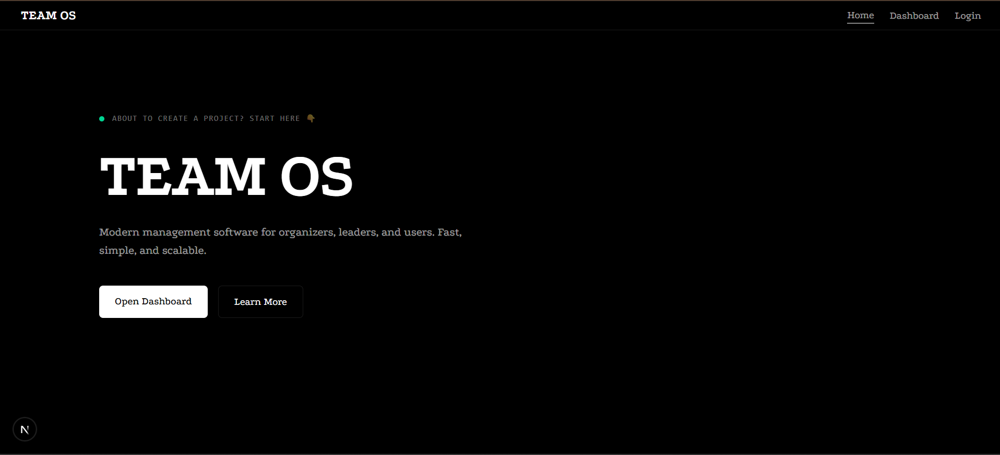

## Team OS

Team OS is a team based access control system for your project. It allows you to create teams, assign users to teams, and manage permissions for each team. Team OS is built with Next.js and TypeScript, and uses Prisma for database management.

